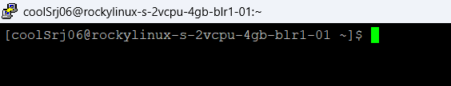

# Server Setup – DigitalOcean Droplet (Rocky Linux 10)

## 1. Droplet Creation

- **Provider:** DigitalOcean  
- **Operating System:** Rocky Linux 10 (x64)  
- **Plan Type:** Basic (Shared CPU)  
- **Size Chosen:** 4 GB RAM / 2 vCPUs / 80 GB SSD  
- **Datacenter Region:** <your-region>  
- **Networking:**  
  - IPv4: Assigned by default  
  - IPv6: Not available during creation in this region (can be enabled later if supported)  
- **Authentication:** SSH key-based login (more secure than password).  
- **Hostname:** `rocky-task-droplet`  

---

# Server Hardening – DigitalOcean Droplet

## Access Method
- Since my local machine is Windows, I used **PuTTY** to access the Droplet instead of native `ssh` commands.
- Steps:
  - Installed PuTTY from the official site.
  - Used the Droplet IP as hostname in PuTTY.
  - Logged in initially as `root`.

## Commands Executed

### 1. Create new non-root user
```bash
adduser coolSrj06
passwd coolSrj06
```
### 2.Grant sudo privileges
```bash
usermod -aG wheel coolSrj06
```

### 3. Copy SSH key to new user
```bash
rsync --archive --chown=coolSrj06:coolSrj06 ~/.ssh /home/coolSrj06
```

### 4. Disable root login

Edited the SSH config:
```bash
sudo nano /etc/ssh/sshd_config
```


**Changed:** 
```nginx
PermitRootLogin no
```

**Applied changes:**
```bash
sudo systemctl restart sshd
```

### Reconnect as coolSrj06




