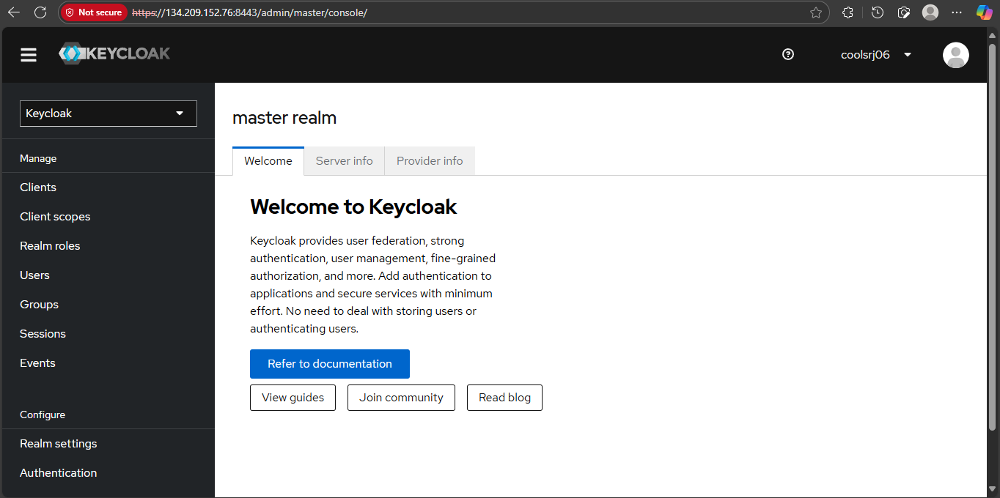

# 🛡️ DigitalOcean Droplet + Keycloak with HTTPS (Systemd)

This document records the complete journey of setting up a **Rocky Linux 10 Droplet** on DigitalOcean, securing it, installing **Keycloak**, and enabling **HTTPS with self-signed TLS**, all managed by **systemd**.

---

## 1️⃣ Droplet Creation
- As till now, Logged into **DigitalOcean console** → Created **Droplet**
- Choices:
  - **OS:** Rocky Linux 10
  - **Plan:** Basic, 2 vCPU / 4 GB RAM
  - **IPv4 + IPv6 enabled**
  - **Authentication:** SSH key (generated via `ssh-keygen` on Windows)
- Hostname set → Droplet created

---

## 2️⃣ Initial Server Hardening
```bash
ssh root@your_droplet_ip

# Create new user
adduser <username>
passwd <username>
usermod -aG wheel <username>

# Disable root SSH login
sudo nano /etc/ssh/sshd_config
# PermitRootLogin no
sudo systemctl restart sshd

# Reconnect
ssh <username>@your_droplet_ip

```
## 3️⃣ Firewall & Core Setup

```bash
# Firewall
sudo systemctl enable --now firewalld
sudo firewall-cmd --permanent --add-service=http
sudo firewall-cmd --permanent --add-service=https
sudo firewall-cmd --permanent --add-service=ssh
sudo firewall-cmd --permanent --add-port=8080/tcp
sudo firewall-cmd --reload

# Core packages
sudo dnf update -y
sudo dnf install epel-release -y
sudo dnf install https://rpms.remirepo.net/enterprise/remi-release-10.rpm -y
sudo dnf module enable php:remi-8.3 -y
sudo dnf install httpd php mariadb-server python3 unzip wget -y
sudo systemctl enable --now httpd php-fpm mariadb
sudo mysql_secure_installation
```

## 4️⃣ Install Java & Keycloak

```bash
# Java 17
sudo dnf install java-17-openjdk-devel -y

# Download Keycloak
cd /opt
sudo wget https://github.com/keycloak/keycloak/releases/download/24.0.4/keycloak-24.0.4.zip
sudo unzip keycloak-24.0.4.zip
sudo mv keycloak-24.0.4 keycloak

# Create user
sudo groupadd keycloak
sudo useradd -r -g keycloak -d /opt/keycloak -s /sbin/nologin keycloak
sudo chown -R keycloak:keycloak /opt/keycloak
```

## 5️⃣ First Startup & Admin User

```bash
# Start in dev mode with admin env vars
sudo -u keycloak KEYCLOAK_ADMIN=<username> KEYCLOAK_ADMIN_PASSWORD='<password>' \
/opt/keycloak/bin/kc.sh start-dev --http-port=8080
```
## 6️⃣ HTTPS Setup (Self-Signed TLS)
```bash
# Generate certs
sudo mkdir -p /etc/x509/https
sudo openssl req -x509 -newkey rsa:4096 \
  -keyout /etc/x509/https/key.pem \
  -out /etc/x509/https/cert.pem \
  -days 365 -nodes \
  -subj "/CN=$(hostname -I | awk '{print $1}')"

# Fix permissions
sudo chown -R keycloak:keycloak /etc/x509/https
sudo chmod 600 /etc/x509/https/key.pem
sudo chmod 644 /etc/x509/https/cert.pem

# Firewall
sudo firewall-cmd --permanent --add-port=8443/tcp
sudo firewall-cmd --reload
```
## 7️⃣ SELinux Fix
```bash
sudo semanage fcontext -a -t cert_t '/etc/x509/https(/.*)?'
sudo restorecon -Rv /etc/x509/https
```
## 8️⃣ Run Keycloak with HTTPS
```bash
sudo -u keycloak KEYCLOAK_ADMIN=<username> KEYCLOAK_ADMIN_PASSWORD='<password>' \
/opt/keycloak/bin/kc.sh start-dev \
  --https-port=8443 \
  --https-certificate-file=/etc/x509/https/cert.pem \
  --https-certificate-key-file=/etc/x509/https/key.pem \
  --hostname-strict=false --hostname-strict-https=false
```

### ✅ Verified:
```bash
curl -kI https://<your-drop-let-id>/
# HTTP/2 302
```

## 9️⃣ Systemd Service Setup

**Unit File:** /etc/systemd/system/keycloak.service
```bash
[Unit]
Description=Keycloak Authorization Server
After=network.target

[Service]
Type=idle
User=keycloak
Group=keycloak
Environment=KEYCLOAK_ADMIN=<username>
Environment=KEYCLOAK_ADMIN_PASSWORD=<password>
ExecStart=/opt/keycloak/bin/kc.sh start --optimized
Restart=on-failure
RestartSec=30
LimitNOFILE=102400
LimitNPROC=102400
TimeoutStartSec=600

[Install]
WantedBy=multi-user.target
```

**Build & Enable**
```bash
# One-time build
sudo -u keycloak /opt/keycloak/bin/kc.sh build

# Reload and start
sudo systemctl daemon-reload
sudo systemctl enable --now keycloak
sudo systemctl status keycloak --no-pager
```
## 🔟 Verification
```bash
# Check response
curl -kI https://<your-drop-let-id>/

# Confirm port listening
ss -tulpn | grep 8443

# Browser access
https://<YOUR_DROPLET_IP>:8443/
```

### ✅ Output:
```bash
HTTP/2 302
location: https://127.0.0.1:8443/admin/
```

### ✅ Final State


```
https://134.209.152.76:8443/
```


1. Keycloak runs on HTTPS 8443
2. Managed by systemd
3. Auto-starts on reboot
4. Admin user created
5. Certificates secured with SELinux
6. Verified with curl + browser

## 📌 Notes

1. Self-signed TLS = browser warning (expected).
2. For production → use a real domain + Let’s Encrypt.
3. Admin env vars can be removed from unit file after first run.

