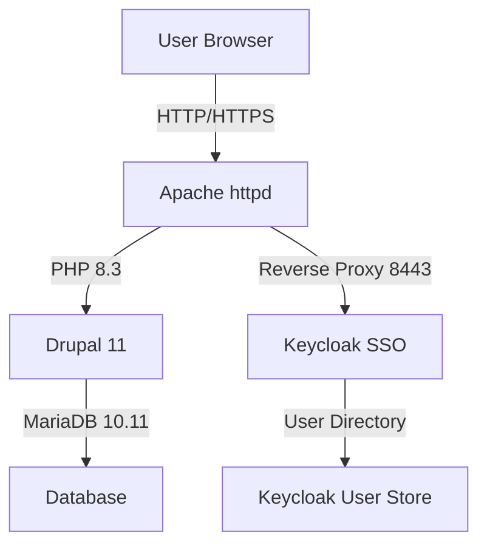
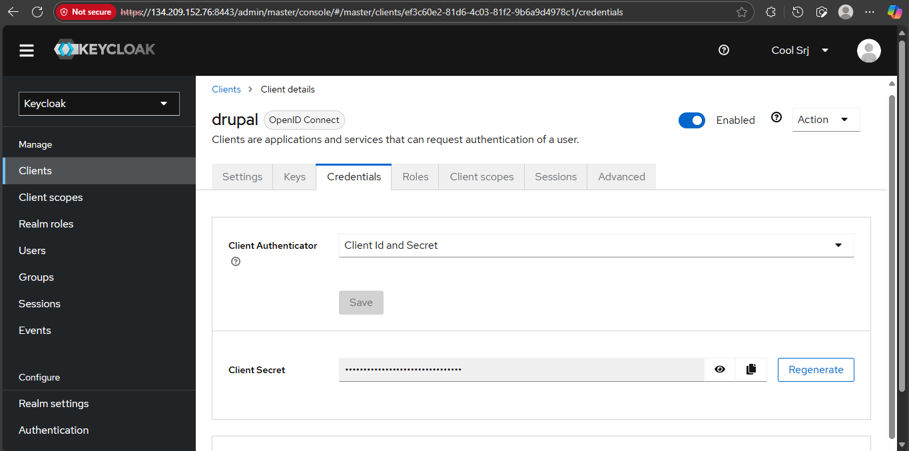
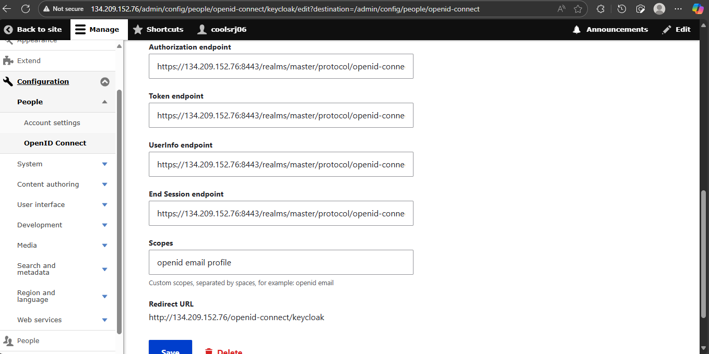
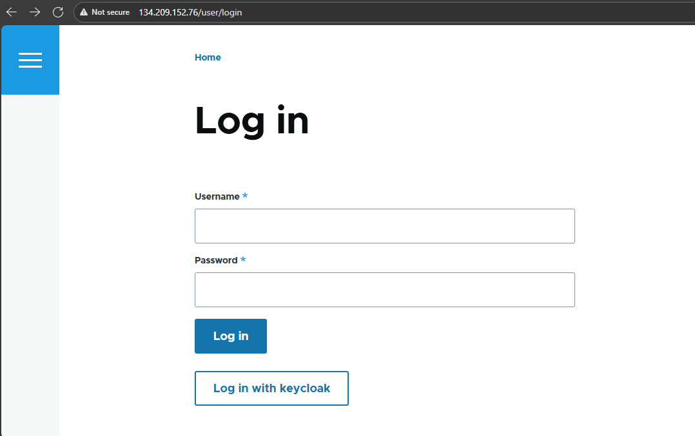
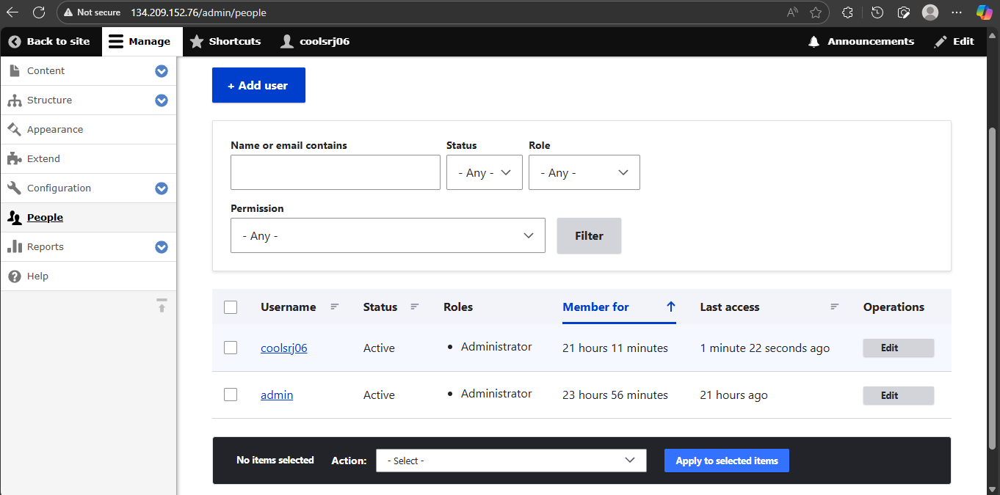
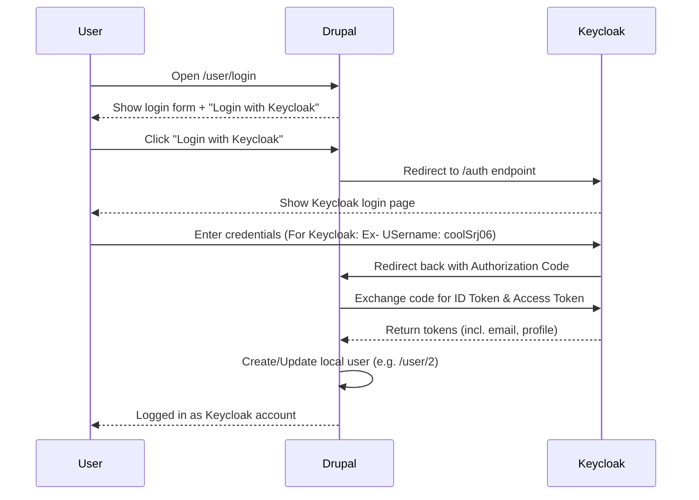

# Drupal 11 + Keycloak SSO (Rocky Linux) — End-to-End Build Guide
 
> It includes **PHP 8.3 upgrade**, **MariaDB 10.11 upgrade**, **Apache vhost**, **SELinux rules**, **Drupal install**, and **OpenID Connect configuration** (with gotchas we hit, like “email not provided”, HTTPS/TLS, etc.).  
> Follow it from top to bottom to reproduce the same working setup.

---

## High-level Architecture


## 0) Assumptions & prerequisites

- Droplet OS: **Rocky Linux 9** (or 10 – commands identical below).
- You already have a running **Keycloak** on the same server at  
  `https://YOUR_SERVER_IP:8443` with a **self-signed cert**.  
  (If not, finish Keycloak first. You should be able to open `https://YOUR_IP:8443/admin/` and log in as Keycloak admin.)
- You’re SSH’d in as a **sudoer** (we used user `coolSrj06`).

---

## 1) System prep

### 1.1 Update OS & base packages

```bash
sudo dnf -y update
sudo dnf -y install epel-release curl unzip wget tar policycoreutils-python-utils
```

---

## 2) PHP 8.3 (required for Drupal 11)

```bash
sudo dnf module list php
sudo dnf -y module reset php
sudo dnf -y module enable php:8.3
sudo dnf -y install php php-cli php-fpm php-mbstring php-xml php-gd php-json php-opcache php-pdo php-mysqlnd php-curl php-zip

sudo systemctl enable --now php-fpm
php -v   # should print PHP 8.3.x
```

---

## 3) MariaDB 10.11

```bash
sudo systemctl stop mariadb || true
sudo dnf -y remove MariaDB-server mariadb mariadb-server || true

sudo tee /etc/yum.repos.d/MariaDB.repo >/dev/null <<'EOF'
[mariadb]
name = MariaDB
baseurl = https://downloads.mariadb.com/MariaDB/mariadb-10.11/yum/rhel/$releasever/$basearch
gpgkey=https://downloads.mariadb.com/MariaDB/MariaDB-Server-GPG-KEY
gpgcheck=1
enabled=1
EOF

sudo dnf -y install MariaDB-server
sudo systemctl enable --now mariadb
sudo mysql_secure_installation
```

**Database for Drupal**

```sql
CREATE DATABASE drupaldb CHARACTER SET utf8mb4 COLLATE utf8mb4_unicode_ci;
CREATE USER 'drupaluser'@'localhost' IDENTIFIED BY 'STRONG_DB_PASSWORD';
GRANT ALL PRIVILEGES ON drupaldb.* TO 'drupaluser'@'localhost';
FLUSH PRIVILEGES;
```

---

## 4) Apache & firewall

```bash
sudo dnf -y install httpd
sudo systemctl enable --now httpd

sudo firewall-cmd --permanent --add-service=http
sudo firewall-cmd --permanent --add-service=https
sudo firewall-cmd --permanent --add-port=8443/tcp
sudo firewall-cmd --reload
```

Add server name:

```bash
echo "ServerName YOUR_SERVER_IP" | sudo tee /etc/httpd/conf.d/servername.conf
sudo systemctl restart httpd
```

---

## 5) Composer

```bash
php -r "copy('https://getcomposer.org/installer', 'composer-setup.php');"
php composer-setup.php --install-dir=/usr/local/bin --filename=composer
composer --version
```

---

## 6) Drupal 11 project

```bash
sudo mkdir -p /var/www
cd /var/www
sudo composer create-project drupal/recommended-project drupal
sudo chown -R apache:apache /var/www/drupal
sudo find /var/www/drupal -type d -exec chmod 755 {} \;
sudo find /var/www/drupal -type f -exec chmod 644 {} \;

sudo mkdir -p /var/www/drupal/web/sites/default/files
sudo chown -R apache:apache /var/www/drupal/web/sites/default/files
```

**SELinux**

```bash
sudo semanage fcontext -a -t httpd_sys_rw_content_t "/var/www/drupal/web/sites/default/files(/.*)?"
sudo restorecon -Rv /var/www/drupal/web/sites/default/files
sudo setsebool -P httpd_can_network_connect 1
```

**Apache vhost**

```bash
sudo tee /etc/httpd/conf.d/drupal.conf >/dev/null <<'EOF'
<VirtualHost *:80>
    ServerName YOUR_SERVER_IP
    DocumentRoot /var/www/drupal/web

    <Directory /var/www/drupal/web>
        AllowOverride All
        Require all granted
    </Directory>

    ErrorLog  /var/log/httpd/drupal_error.log
    CustomLog /var/log/httpd/drupal_access.log combined
</VirtualHost>
EOF

sudo apachectl configtest
sudo systemctl restart httpd
```

---

## 7) Drupal web installer

1. Visit `http://YOUR_SERVER_IP/`  
2. If installer asks for settings file:

```bash
sudo cp /var/www/drupal/web/sites/default/default.settings.php /var/www/drupal/web/sites/default/settings.php
sudo chown apache:apache /var/www/drupal/web/sites/default/settings.php
sudo chmod 644 /var/www/drupal/web/sites/default/settings.php
```

3. DB settings: use `drupaldb` / `drupaluser` / `STRONG_DB_PASSWORD`, host `127.0.0.1`  
4. Create first local admin user (`admin`).

---

## 8) Install OpenID Connect module

```bash
cd /var/www/drupal
sudo -u apache COMPOSER_HOME=/tmp/composer composer config prefer-stable true
sudo -u apache COMPOSER_HOME=/tmp/composer composer require drupal/openid_connect:^3.0@alpha -W
```

Enable in **Extend** → search “OpenID Connect”.

---

## 9) Keycloak client for Drupal

1. Clients → Create client  
   - Client ID: `drupal`  
   - Type: OpenID Connect  
   - Confidential, Standard Flow ON  
   - Redirect URIs: `http://YOUR_SERVER_IP/openid-connect/keycloak`  
   - Web origins: `http://YOUR_SERVER_IP`  

2. Copy the client secret (Credentials tab).  
3. Under **Client scopes**, ensure `email` and `profile` are default.  
4. User in Keycloak must have a valid **email**.



---

## 10) Drupal OpenID Connect client

Configuration → People → OpenID Connect → Add client:

- Name: `Keycloak`  
- Client ID: `drupal`  
- Client secret: (paste)  
- Authorization: `https://YOUR_SERVER_IP:8443/realms/master/protocol/openid-connect/auth`  
- Token: `https://YOUR_SERVER_IP:8443/realms/master/protocol/openid-connect/token`  
- Userinfo: `https://YOUR_SERVER_IP:8443/realms/master/protocol/openid-connect/userinfo`  
- End session: `https://YOUR_SERVER_IP:8443/realms/master/protocol/openid-connect/logout`  
- Scopes: `openid email profile`  

Global settings:  
- Save user claims on every login ✔  
- Logout from identity provider ✔  
- Buttons display: Above (or Replace)


---

## 11) First login with Keycloak

1. Go to `/user/login` → click **Log in with Keycloak**  
2. Authenticate at Keycloak → redirected back → new Drupal user created (e.g. `/user/2`).  
3. If error:  
   - “No email address provided” → add email to Keycloak user & default email scope.  
   - “Failed to get tokens” → check client secret, endpoints, SELinux `httpd_can_network_connect=1`.

   

---

## 12) Promote SSO user to Administrator

1. Log in as local admin (`/user/1`).  
2. Manage → People → Edit `coolSrj06` (or your Keycloak user).  
3. Tick **Administrator** role.  
4. Save.  
5. Now Keycloak login gives you full admin rights.

---

## 13) Verify

- `php -v` → 8.3.x  
- `mysql --version` → 10.11.x  
- Drupal home loads.  
- `/user/login` shows Keycloak login button.  
- Keycloak login succeeds and logs you into `/user/2` with admin role.

---

## 14) Best practices

- Keep `/user/1` local admin as fallback.  
- Use `/user/2` (Keycloak account) for daily admin.  
- Once domain & cert ready, switch Apache to HTTPS + update Keycloak redirect URIs.



---

## 15) Troubleshooting quick notes

- Token endpoint 405 on curl GET → expected, must POST.  
- If login loops → check redirect URI matches exactly.  
- If no email → add Keycloak email claim.  
- If Drupal blocks user creation → tick “Override registration settings” in OIDC config.

---

### Finally the Login Flow


✅ You now have Drupal 11 on PHP 8.3 + MariaDB 10.11 with Keycloak S


