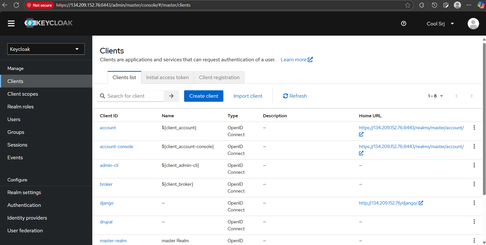
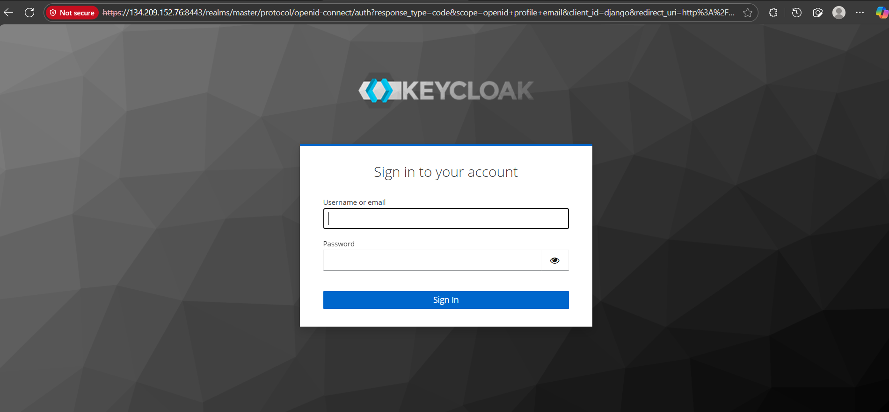
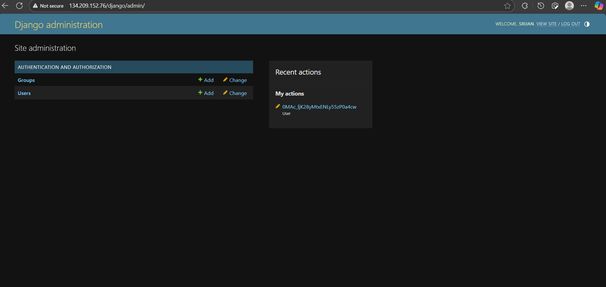

# 🔑 Django + Keycloak + Apache + Gunicorn + Drupal (same server)

This guide documents how to run **Django behind Apache with Gunicorn** and configure **Keycloak OIDC SSO**, while keeping **Drupal served at root**.  
It’s based on a full setup + troubleshooting experience (lots of pitfalls included).

---

## 🗂️ Project Layout
- `/var/www/drupal` → Drupal (served at `http://SERVER_IP/`)
- `/var/www/django_project` → Django project (served at `http://SERVER_IP/django/`)
- Gunicorn → Django WSGI server (binds to `127.0.0.1:8000`)
- Apache → Reverse proxy + static serving
- Keycloak → Self-hosted at `https://SERVER_IP:8443/`

---

## ⚡ Step 1: Install prerequisites
```bash
sudo dnf install httpd mod_ssl python3 python3-venv mariadb-server
sudo systemctl enable --now httpd mariadb
```

## ⚡Step 2: Setup Django Project

```bash
cd /var/www
python3 -m venv django_project/venv
source django_project/venv/bin/activate

pip install django gunicorn mysqlclient mozilla-django-oidc
django-admin startproject mysite django_project
```

Note: You may get few errors while installing **mysqlclient** you need to debug the errors and fix it.

## ⚡Step 3: Gunicorn Service

Create /etc/systemd/system/gunicorn.service:

```bash
[Unit]
Description=gunicorn daemon for Django project
After=network.target

[Service]
User=<username>
Group=<username>
WorkingDirectory=/var/www/django_project
Environment="PATH=/var/www/django_project/venv/bin"
ExecStart=/var/www/django_project/venv/bin/gunicorn --workers 3 --bind 127.0.0.1:8000 mysite.wsgi:application
Restart=on-failure

[Install]
WantedBy=multi-user.target
```

Enable & test:

```bash
sudo systemctl daemon-reload
sudo systemctl enable --now gunicorn
curl http://127.0.0.1:8000
```

## ⚡Step 4: Apache Config (Drupal + Django under /django/)

Edit the **/etc/httpd/conf.d/drupal.conf:** which was created earlier when configuring drupal

```bash
<VirtualHost *:80>
    ServerName <server-public-ip>

    # ===== Drupal at root =====
    DocumentRoot /var/www/drupal/web
    <Directory /var/www/drupal/web>
        AllowOverride All
        Require all granted
        DirectoryIndex index.php index.html
        Options -Indexes
    </Directory>

    # ===== Django under /django/ =====
    # Serve Django static directly from Apache (already collected to STATIC_ROOT)
    Alias /django/static/ /var/www/django_project/static/
    <Directory /var/www/django_project/static/>
        Require all granted
        Options -Indexes
    </Directory>

    # Proxy the Django app to Gunicorn on localhost:8000
    ProxyPreserveHost On
    RequestHeader set X-Forwarded-Proto "http"
    # RequestHeader set X-Forwarded-Host  "134.209.152.76"

    # Don't proxy static; only app traffic
    ProxyPass       /django/static/ !
    ProxyPass       /django/ http://127.0.0.1:8000/
    ProxyPassReverse /django/ http://127.0.0.1:8000/

    ErrorLog  /var/log/httpd/drupal_error.log
    CustomLog /var/log/httpd/drupal_access.log combined
</VirtualHost>
```

Restart Apache:

```bash
sudo systemctl restart httpd
```

## ⚡Step 5: Django Settings Highlights

Replabe the /var/www/django_project/mysite/settings.py with the below code

```bash
from pathlib import Path
import os

BASE_DIR = Path(__file__).resolve().parent.parent

#use the secret key that is there by default in this file
SECRET_KEY = '<a secret key by default Django creates settings.py and inside it, it auto-generates a random 50-character string as SECRET_KEY.>'
DEBUG = True
ALLOWED_HOSTS = ["<Server-Public-IP>", "127.0.0.1", "localhost"]

INSTALLED_APPS = [
    'django.contrib.admin',
    'django.contrib.auth',
    'django.contrib.contenttypes',
    'django.contrib.sessions',
    'django.contrib.messages',
    'django.contrib.staticfiles',
    'mozilla_django_oidc',
]

MIDDLEWARE = [
    'django.middleware.security.SecurityMiddleware',
    'django.contrib.sessions.middleware.SessionMiddleware',
    'django.middleware.common.CommonMiddleware',
    'django.middleware.csrf.CsrfViewMiddleware',
    'django.contrib.auth.middleware.AuthenticationMiddleware',
    'django.contrib.messages.middleware.MessageMiddleware',
    'django.middleware.clickjacking.XFrameOptionsMiddleware',
]

ROOT_URLCONF = 'mysite.urls'

TEMPLATES = [
    {
        'BACKEND': 'django.template.backends.django.DjangoTemplates',
        'DIRS': [],
        'APP_DIRS': True,
        'OPTIONS': {
            'context_processors': [
                'django.template.context_processors.debug',
                'django.template.context_processors.request',
                'django.contrib.auth.context_processors.auth',
                'django.contrib.messages.context_processors.messages',
            ],
        },
    },
]

WSGI_APPLICATION = 'mysite.wsgi.application'

DATABASES = {
    'default': {
        'ENGINE': 'django.db.backends.mysql',
        'NAME': 'djangodb',
        'USER': 'djangouser',
        'PASSWORD': '<db-password>',
        'HOST': 'localhost',
        'PORT': '3306',
        'OPTIONS': {'charset': 'utf8mb4'},
    }
}

AUTH_PASSWORD_VALIDATORS = [
    {'NAME': 'django.contrib.auth.password_validation.UserAttributeSimilarityValidator'},
    {'NAME': 'django.contrib.auth.password_validation.MinimumLengthValidator'},
    {'NAME': 'django.contrib.auth.password_validation.CommonPasswordValidator'},
    {'NAME': 'django.contrib.auth.password_validation.NumericPasswordValidator'},
]

LANGUAGE_CODE = 'en-us'
TIME_ZONE = 'UTC'
USE_I18N = True
USE_TZ = True

FORCE_SCRIPT_NAME = "/django"
USE_X_FORWARDED_HOST = True
SECURE_PROXY_SSL_HEADER = ('HTTP_X_FORWARDED_PROTO', 'https')

CSRF_TRUSTED_ORIGINS = ["http://<Server-Public-IP>", "https://<Server-Public-IP>", "http://127.0.0.1", "http://localhost"]

STATIC_URL = "/django/static/"
STATIC_ROOT = os.path.join(BASE_DIR, "static")

DEFAULT_AUTO_FIELD = 'django.db.models.BigAutoField'

AUTHENTICATION_BACKENDS = [
    'mozilla_django_oidc.auth.OIDCAuthenticationBackend',
    'django.contrib.auth.backends.ModelBackend',
]

LOGIN_URL = "/django/oidc/authenticate/"
LOGIN_REDIRECT_URL = "/django/admin/"
LOGOUT_REDIRECT_URL = "/django/admin/"

# Your Keycloak client (realm: master, host uses self-signed HTTPS on 8443)
OIDC_RP_CLIENT_ID = "django"
OIDC_RP_CLIENT_SECRET = "<Client Secret COPY FROM Keycloak>"   # <-- put the real secret here

# Ask for useful standard claims
OIDC_RP_SCOPES = "openid profile email"
OIDC_RP_SIGN_ALGO = "RS256"

# Keycloak endpoints
OIDC_REDIRECT_URI = "http://<Server-Public-IP>/django/oidc/callback/"
OIDC_OP_AUTHORIZATION_ENDPOINT = "https://<Server-Public-IP>:8443/realms/master/protocol/openid-connect/auth"
OIDC_OP_TOKEN_ENDPOINT         = "https://<Server-Public-IP>:8443/realms/master/protocol/openid-connect/token"
OIDC_OP_USER_ENDPOINT          = "https://<Server-Public-IP>:8443/realms/master/protocol/openid-connect/userinfo"
OIDC_OP_JWKS_ENDPOINT          = "https://<Server-Public-IP>:8443/realms/master/protocol/openid-connect/certs"

# Self-signed cert at an IP: allow for demo (flip to True once you use a real cert/domain)
OIDC_VERIFY_SSL = False

# Store tokens (handy if you later call Keycloak logout or APIs)
OIDC_STORE_ID_TOKEN = True
OIDC_STORE_ACCESS_TOKEN = True
```

## ⚡Step 6: Keycloak Client Config

Inside Keycloak → Clients → django:

Root URL:
**http://SERVER_IP/django/**

Home URL:
**http://SERVER_IP/django/**

Valid Redirect URIs:
**http://SERVER_IP/django/oidc/callback/**

Web origins:
**http://SERVER_IP**

Admin URL:
**http://SERVER_IP/django/**

⚠️ Redirect URI must match exactly (with trailing slash).



## ⚡ Step 7: Common Pitfalls & Fixes

1. Drupal disappeared / HTTP test page → multiple vhosts conflicting → only one *:80 vhost with Drupal + Django proxy.

2. Always redirected to HTTPS → check SECURE_PROXY_SSL_HEADER matches Apache (http or https).

3. DisallowedHost → add SERVER_IP to ALLOWED_HOSTS.

4. Invalid redirect_uri → must match exactly in both Django & Keycloak.

5. Logged in but no admin rights → user not is_staff. Fix via Keycloak roles + custom backend.

## ✅ Final Flow

1. Visit http://SERVER_IP/django/oidc/authenticate

2. Redirect → Keycloak login page.



3. Authenticate with Keycloak.

4. Redirect back → http://SERVER_IP/django/oidc/callback/

5. User created (or updated), logged into Django.

6. If is_staff=True, access Django admin.


